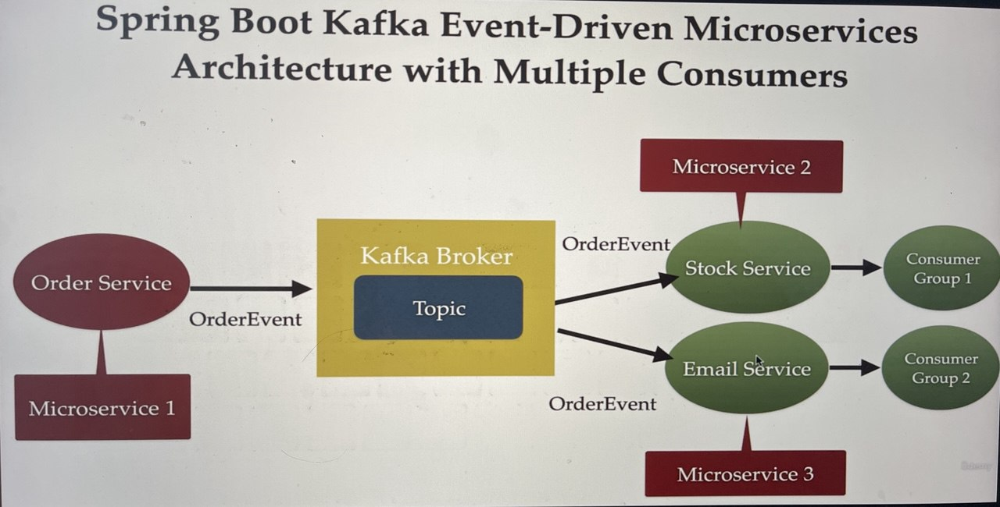

# Spring boot apache kafka Udemy course by Ramesh 

- https://udemy.com/course/spring-boot-and-apache-kafka

Source code
- https://github.com/RameshMF/springboot-kafka-course

50 must read microservices tutorials
- https://medium.com/javaguides/my-50-must-read-microservices-tutorial-articles-and-guides-on-medium-platform-3e54a63b2671
- https://medium.com/javaguides/spring-spring-boot-annotations-your-complete-reference-guide-6dba02e14cd7
- https://www.youtube.com/c/javaguides

## Install kafka
- https://kafka.apache.org/quickstart

## Run Kafka Server
```
$ cd kafka
$ kafka % KAFKA_CLUSTER_ID="$(bin/kafka-storage.sh random-uuid)"                                   
$ kafka % bin/kafka-storage.sh format --standalone -t $KAFKA_CLUSTER_ID -c config/server.properties
$ kafka % bin/kafka-server-start.sh config/server.properties
```

## Architecture


## Project modules
- base-domains
- order-service
- stock-service
- email-service

## Usage scenarios
1. Run Application classes in each module except base-domains.

2. Talent API Tester 
POST
http://localhost:8080/api/v1/order
```
{
  "name": "first order",
  "qty": 9,
  "price": 999.99
}
```

3. Console output:
- Order event => OrderEvent(message=Order status is pending, status=PENDING, order=Order(orderId=43c2260f-071b-4a89-a8cf-416f3ac34f87, name=first order, qty=9, price=999.99))
- [Consumer clientId=consumer-stock-1, groupId=stock] Subscribed to topic(s): order_topics
- Order event received in email service => OrderEvent(message=Order status is pending, status=PENDING, order=Order(orderId=43c2260f-071b-4a89-a8cf-416f3ac34f87, name=first order, qty=9, price=999.99))
- Order event received in stock service => OrderEvent(message=Order status is pending, status=PENDING, order=Order(orderId=43c2260f-071b-4a89-a8cf-416f3ac34f87, name=first order, qty=9, price=999.99))
